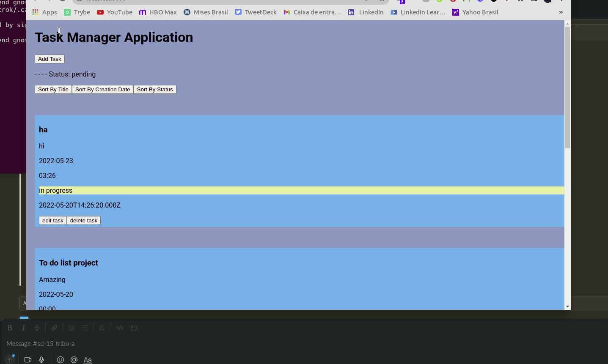

# To-Do-List

## Welcome to my To Do List App

This application is being created to manage your day-to-day activities and it is super simple to use.

### To Do List App Deployed
[Front End To Do List Application](https://to-do-list-front-end-lovat.vercel.app/)

### How to install

If you want to see the app running for yourself or test on your machine and change stuff, you can easily do it with [node](https://nodejs.org/en/) installed on your computer. Obs: I ran the project on linux-ubuntu but that's not really required.

- Choose any folder on your pc, open the terminal and run the command: `git clone git@github.com:ArTrok/To-Do-List.git`
- Then enter the new cloned folder with: `cd To-Do-List`
- And install the packages with: `npm install`
- After installing the main package, go for the subfolders `Frontend` and `Backend` and run `npm install` on each of them.

#### Starting the app
- As a last step, all you gotta do is to run the command `npm start` on each `Frontend` and `Backend`.

#### Running the tests
- You can run the tests using the command: `npm test` on each `Frontend` and `Backend` folder.

Now you should be able to see the app locally. Have fun!

### Future Implementations
- Run the app with Docker Container on both sides Back and Front.
- ContextAPI to update task array instantly when deleted or updated.
